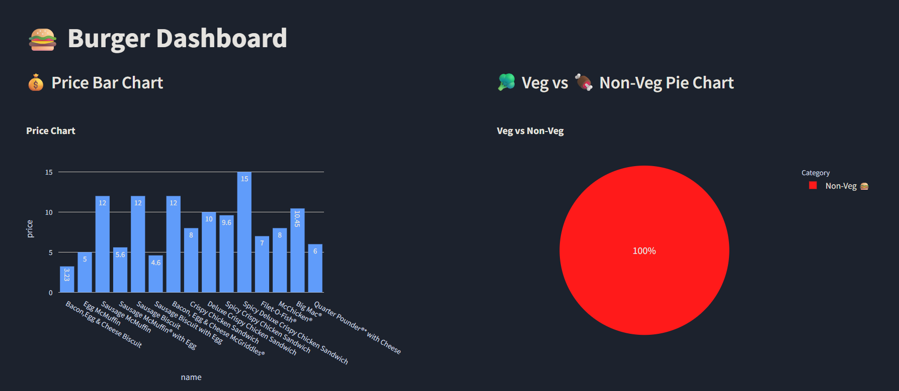

# 🍔 Burger Dashboard

A simple and interactive dashboard built with **Streamlit**, **DuckDB**, and **Plotly** to visualize burger prices and classify them as Veg or Non-Veg.



## 🌍 Live Demo

Try the Burger Dashboard live on Streamlit Cloud:

👉 [Click here to view the app](https://your-username-burger-dashboard.streamlit.app)


---

## 🚀 Features

- 📊 **Bar Chart**: Visualize burger prices
- 🥦 **Pie Chart**: See Veg vs Non-Veg distribution
- 🔐 Uses `.env` for secret keys/config (via `python-dotenv`)

---

## 📦 Tech Stack

- [Streamlit](https://streamlit.io/)
- [DuckDB](https://duckdb.org/)
- [Plotly](https://plotly.com/python/)
- [Python Dotenv](https://pypi.org/project/python-dotenv/)

---

## 🧪 Getting Started

### 🔧 Prerequisites

Make sure you have Python 3.8+ installed.

### 🛠️ Installation

```bash
# Clone the repo
git clone https://github.com/YOUR_USERNAME/burger-dashboard.git
cd burger-dashboard

# Create a virtual environment (optional but recommended)
python -m venv venv
source venv/bin/activate

# Install dependencies
pip install -r requirements.txt

# Run the script
run_script.sh
